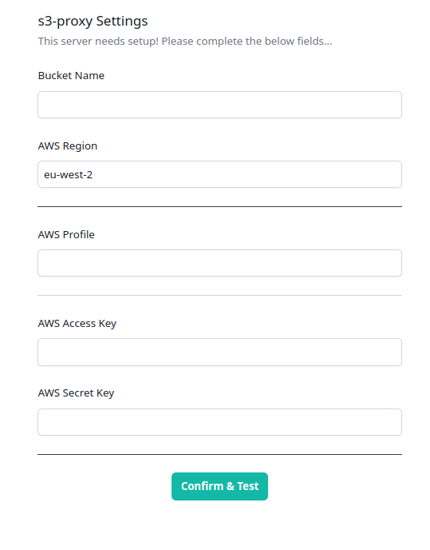
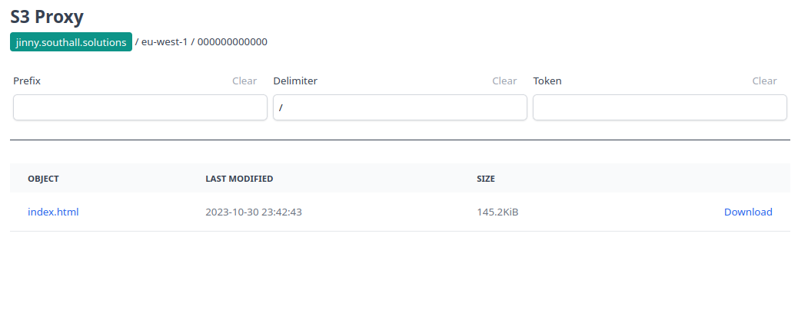

# s3proxy

s3proxy is a web interface for S3 buckets providing access to S3 objects with a web service rather than via the AWS Console, API calls or other methods.

**Use Cases**

- Access to assets in internal environments without using AWS API calls
- An internal asset server
- A faster interface than AWS S3, which seems to be getting slower and more annoying with time
- Quick S3 asset review without logging in (ie, using CLI credentials rather than a full login process)

## Configuration

If you don't provide any configuration then on start the server will ask you to provide the required credentials and target bucket:

<p align="center">
  
</p>

If you get any issues then you'll get friendly notifications telling you what went wrong, otherwise you'll get a link straight to your bucket

<p align="center">
  
</p>

## Usage

Regular files are available to download with the `Download` links. "Directories" are not actually directories in S3 world, they're prefixes to object names. If there's a common prefix you'll get a `List` option rather than a download. When you click on that the page will repopulate with objects that only have that prefix.

It'll feel just like a file system browser but in the background there's that framing of prefixes vs directories.

#### Direct Proxying

Each object in the bucket can be accessible via `/fetch/<object-name>`. For example, if you had a company logo in your bucket at `s3://companybucket.com/company-images/logo.png` then after targeting s3proxy to the bucket `companybucket.com` and giving it the required credentials you can hit `http://s3proxy.local/fetch/company-images/logo.png` and get your logo.

You can either provide access key + secret or mount a credentials file and provide a profile to use. If you're mounting your credentials and config files you'll need to target the path for your mount with the below AWS variables. Check out the `docker/` directory for some docker compose files that demonstrate some standard settings.

## Variables

#### s3proxy

```
TARGET_BUCKET => The name of the bucket to target. If you don't provide this as an environment variable to the container then you'll get the settings page
```

Additionally you may want to set common headers for stuff like CORS. You can do this with a prefixed environment variable: **S3PROXYHEADER_**. So for allowing for GET, HEAD and OPTIONS requests from any origin:

> S3PROXYHEADER_Access_Control_Allow_Origin="*"
> S3PROXYHEADER_Access_Control_Allow_Methods="GET,HEAD,OPTIONS"
> S3PROXYHEADER_Access_Control_Max_Age="86400"

Underscores after S3PROXYHEADER_ are turned into hyphens.

#### AWS

```
# Either:

AWS_ACCESS_KEY_ID => Your user key ID
AWS_SECRET_ACCESS_KEY => Your user secret

# -or-

AWS_DEFAULT_PROFILE => The AWS profile to use
AWS_SHARED_CREDENTIALS_FILE => The location where you've mounted your credentials file with the desired profile
AWS_CONFIG_FILE => The location where you've mounted your config file with the desired profile

# -and optionally-

AWS_DEFAULT_REGION => Set this to your bucket's region if you're having issues

```

## Deployment

As a container driven application you can run this via the prebuilt image at smasherofallthings/s3proxy. Naturally, this lends itself well to Kubernetes and you can find jinja templates for manifests under the k8s directory in this repo.

Additionally, you'll find preformatted docker-compose files for common use cases. Please note that all of the following have the standard browser headers set for CORS and caching. This is so browsers don't hammer s3proxy into oblivion for frontend assets and so you can use s3proxy endpoints on other sites.

Also, all docker compose files use the host network. If you want to use specific ports then you'll want to edit the files. Default port is `3000`.

I've set the files to use the host network as `docker compose run s3proxy` won't bind port definitions without also providing the `--service-ports` for security reasons. Docker won't warn you that it's ignoring your port configurations which makes it a horrid time sink to work out. The up command - `docker compose up` - will work with either explicit ports or the host network configuration. Do what you like!

#### local-aws
The docker compose file in the `local-aws` directory automounts your `$HOME/.aws` directory into the container at `/aws`. It also sets the AWS environment variables so that s3proxy knows where to find these creds. On boot you'll get the settings screen, but all you'll need to provide is your AWS Profile name and the bucket name and you're good to go.

This is intended as a local fast browsing service for S3 Buckets.

#### plain
The docker compose file in the `plain` directory does not provide any configuration settings, hence you'll need to provide those settings at the settings screen. This may include sending a full stack of secrets to get full configuration. As this service does not run on TLS so you may not want to do that.

#### standalone
The docker compose file in the `standalone` directory provides the full settings needed for an auto bootup of s3proxy without needing to go through the settings page. This file won't "just work" as you'll need to provide the credentials and bucket name. However, if you provide those details correctly and run the service s3proxy will boot up with no issues. This is the sort of configuration you'll deploy when you want s3proxy to run as a full service.

